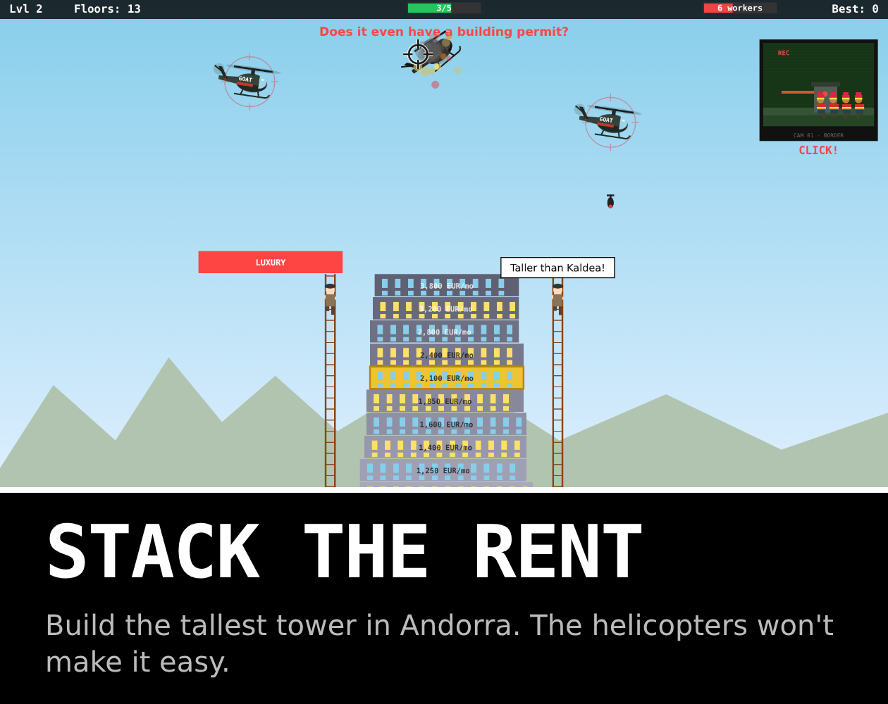

# Stack the Rent

<p align="center">
    <a href="https://edulazaro.itch.io/stack-the-rent"></a>
    <a href="https://github.com/edulazaro/stack-the-rent/actions/workflows/tests.yml"></a>
    <a href="https://github.com/edulazaro/stack-the-rent/blob/main/package.json"></a>
    <a href="https://react.dev"></a>
    <a href="https://www.typescriptlang.org"></a>
    <a href="https://github.com/edulazaro/stack-the-rent/blob/main/LICENSE.md"></a>
</p>

Arcade tower stacker about Andorra's housing market. Build the tallest tower you can while rent goes up with every floor, the old men comment from the ladders, the GOAT (Group Organized Against Towers) helicopters bomb it and climbers abseil down its sides to smash it.



**[Play it in your browser on itch.io](https://edulazaro.itch.io/stack-the-rent)**. Works on desktop and mobile, in English, Spanish and Catalan.

## How to play

| | Desktop | Mobile |
|---|---|---|
| Place a floor | Space | BUILD buttons |
| Shoot helicopters and climbers | Click | Tap |
| Open the border | Click the CCTV camera | Tap the CCTV camera |
| Pause | P or Esc | Pause button |
| Mute | M | Sound button |

- The better you line up a floor, the less of it gets trimmed off. A perfect drop keeps the full width.
- Every floor costs a worker. Run out and you can't build until you open the border and let more in.
- Golden union rep blocks trigger a strike (helicopters leave) or a collective agreement (free workers).
- Every 10 floors a new full-width platform appears.
- The tower has 5 hit points. Bombs and climbers take them away; at 0 it collapses.

On phones the game plays fullscreen in landscape.

## Development

Requires Node 24 and pnpm.

```bash
pnpm install
pnpm dev          # web page version at http://localhost:5301
pnpm dev:itch     # itch.io version (only the game, filling the viewport)
pnpm check        # types + lint/format (Biome) + tests (Vitest)
pnpm build        # production build in dist/
pnpm build:itch   # dist-itch/ and stack-the-rent-itch.zip, ready to upload to itch.io
```

## Project structure

```
src/
  game/      game logic without React or canvas (state, rules, texts, tests)
  render/    canvas drawing, reads the state and never changes it (theme.ts has every color and font)
  shell/     reusable shell: fixed 60 Hz loop, fullscreen/landscape handling, pause, menus, audio, music, i18n
  music/     background music tracks
  sounds.ts  every sound effect, synthesized with the Web Audio API
  Game.tsx   React layer: screens and input
itch/        cover, screenshots and store page text
```

Stack: Vite, React 19, TypeScript, Tailwind CSS v4. No game engine: everything is drawn with the Canvas 2D API and every sound effect is synthesized. The background music was made with Suno.

## Embedding

The game can be placed in another site with an iframe. The host can fix the language, which hides the in-game language selector:

```html
<iframe src="https://example.com/stack-the-rent/?lang=es" width="960" height="540" allow="fullscreen"></iframe>
```

```js
// Change the language later from the parent page
iframe.contentWindow.postMessage({ type: "set-locale", locale: "ca" }, "*");
```

Without `?lang`, the game uses the player's last choice or the browser language (English unless Spanish or Catalan).

Every [GitHub release](https://github.com/edulazaro/stack-the-rent/releases) includes `stack-the-rent-itch.zip`, the built game ready to serve from any static host.

## Sponsors

Stack the Rent is supported by the following sponsors. Thank you for keeping it growing:

<p>
  <a href="https://andorradev.com"></a>&nbsp;<a href="https://andorradev.com">AndorraDev</a>&nbsp;&nbsp;&nbsp;&nbsp;
  <a href="https://andorranos.com"></a>&nbsp;<a href="https://andorranos.com">Andorranos</a>&nbsp;&nbsp;&nbsp;&nbsp;
  <a href="https://andorrawork.com"></a>&nbsp;<a href="https://andorrawork.com">AndorraWork</a>
</p>

## Author

Created by [Edu Lazaro](https://edulazaro.com)

## License

Stack the Rent is open-sourced software licensed under the [MIT license](LICENSE.md). The music in `src/music/` is not covered by this license.
